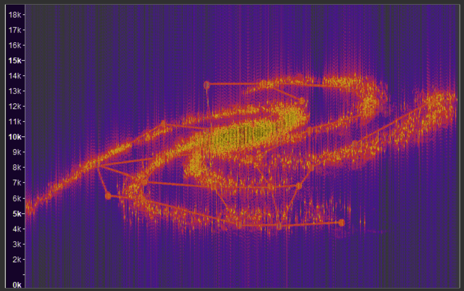
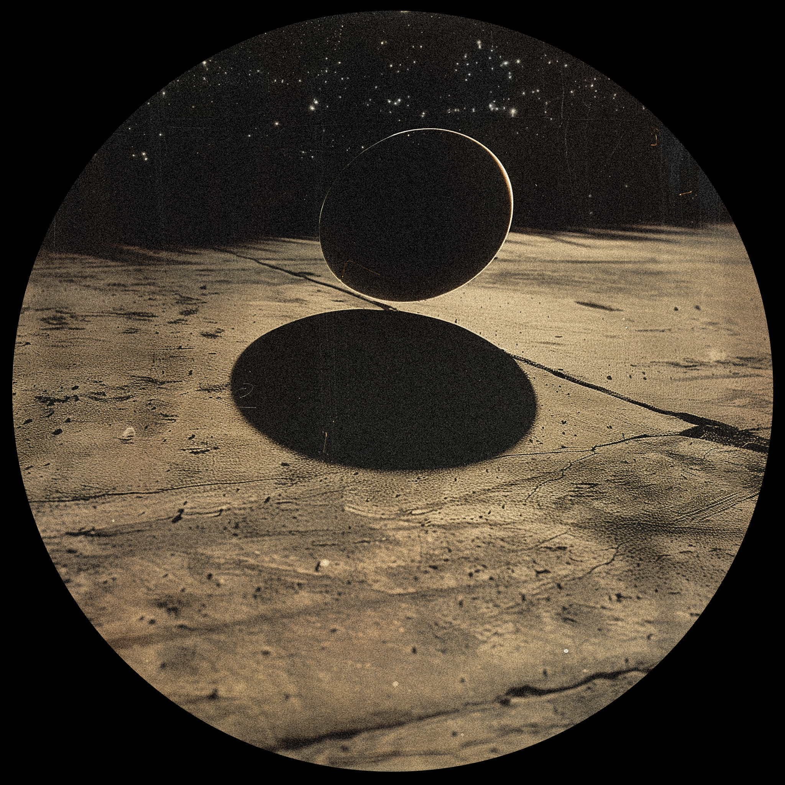

## Writing

### SCP Foundation

I've been an active writer on the web phenomenon SCP Foundation collaborative
writing project since high school. My stories often take the established
epistolary format of the wiki and stretch it into weirder, more unnerving
directions. I've tended to explore themes of cosmic horror, free will, and human
nature through these works, as well as play with notions of structure, "canon,"
and the idea of what constitutes reality or narrative. A selection of my
favorite entries and best showcases of my work are below:

- **[SCP-3426: Reckoner](https://scp-wiki.wikidot.com/scp-3426)**
- **[SCP-6511: OBLIVION ACCESS](https://scp-wiki.wikidot.com/scp-6511)**
- **[SCP-6100: On Golden Skies](https://scp-wiki.wikidot.com/scp-6100)**
- **[SCP-6533: This Will Require A Great Amount of Blood](https://scp-wiki.wikidot.com/scp-5633)**

### Music Writing

I also enjoy writing and blogging about music in my free time, with a special
focus on electronic music and internet-based scenes not often covered by major
music publications. Selected work from my blog:

- **[Dreaming of Collapse: 10 Years of Boards of Canada's _Tomorrow's Harvest_](https://metamodernsounds.substack.com/p/dreaming-of-collapse-ten-years-of)**
- **[A Hole at the Center of Everything](https://metamodernsounds.substack.com/p/a-hole-at-the-center-of-everything)**
- **[Reflections on _FEZ_ and the Creative Process](https://metamodernsounds.substack.com/p/reflections-on-disasterpeaces-fez)**
- **[Oneohtrix Point Never: Answering Machine Memories](https://metamodernsounds.substack.com/p/answering-machine-memories)**

## Tech

## The Endless Mile

_The Endless Mile_ is a "collage engine" conceived by artist Johannes DeYoung,
an artwork projected onto rooms and 3D surfaces that procedurally generates
geometric forms and silhouettes in a manner reminiscent of ancient scrolls and
cave paintings. Over the course of 2023 and 2024 I collaborated with him to
develop a radical new way to add sonic interactivity to his system. I
reapproached the concept of audio visualization by training a neural network on
a corpus of electronically synthesized sounds, and building a patch in Max/MSP
to teach it how to animate and distort simple 3D motion graphics according to
its own internal logic. Although it started loosely based on typical constraints
of volume and frequency, it quickly began to take an alien logic of its own.

My full report, detailing process and research, is available for download
[here](https://drive.google.com/file/d/1Oh5ckW6_tsmgWcI3YsIQXm9YByT1g9Us/view?usp=sharing).
